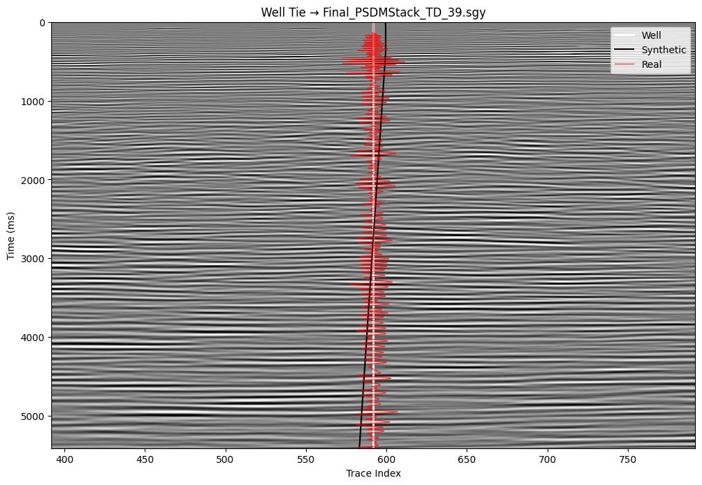
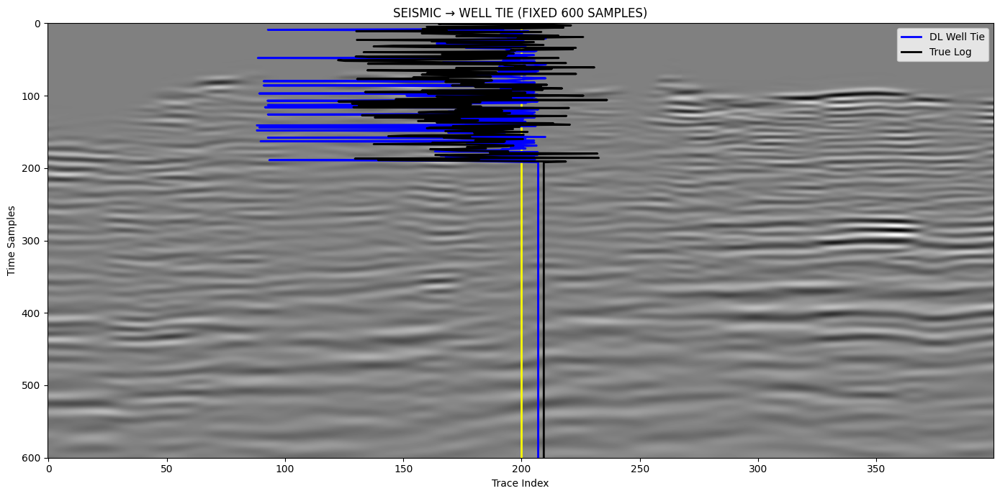
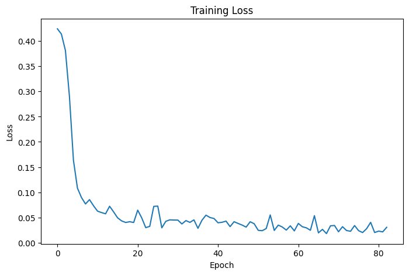
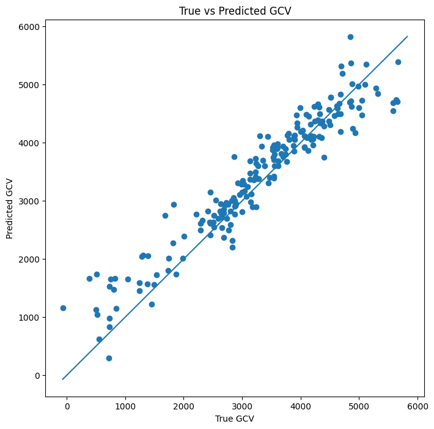
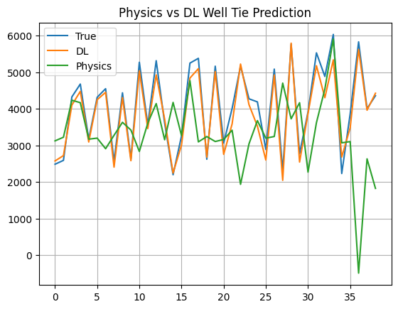
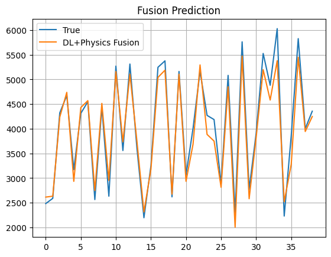
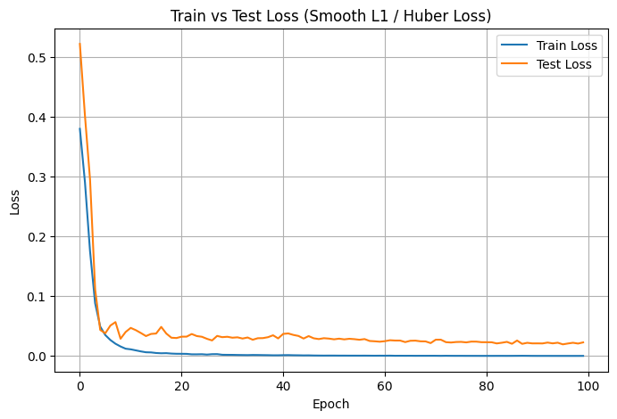
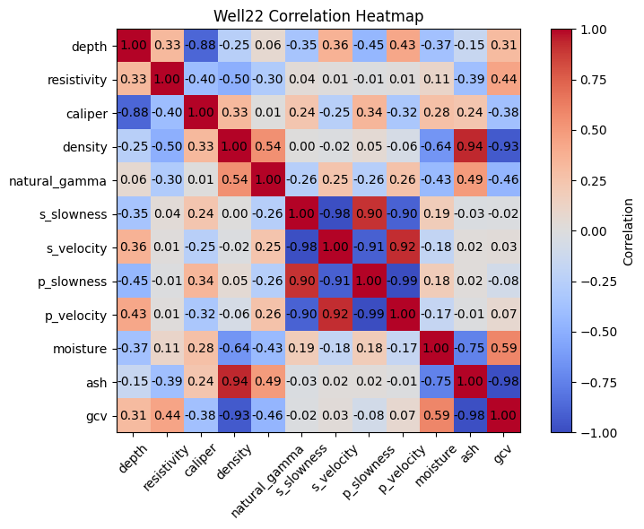

# GeoFusion

**Multimodal deep learning for AI-driven coal quality (GCV) estimation from wireline logs and 3D seismic data.**

GeoFusion fuses wireline geophysical logs (density, resistivity, gamma-ray, sonic) with 3D post-stack seismic volumes to estimate coal quality parameters — principally Gross Calorific Value (GCV) — continuously along and between boreholes. The project was developed for **Bhoomathon 2026**, the national-level mathematical geoscience hackathon organised by the IAMG-IITB Student Chapter, Department of Earth Sciences, IIT Bombay.

> **Publication status:** A manuscript describing this work is currently under review.

## Motivation

Coal quality is conventionally assessed through laboratory proximate analysis of core samples — accurate, but sparse, slow, and expensive to acquire. GCV, the key economic and regulatory grading parameter under India's ISP 2022 norms, must currently be interpolated between boreholes using geostatistics, which struggles with the structural heterogeneity of Indian coal seams. GeoFusion asks whether a deep learning model trained on wireline logs — and extended laterally with 3D seismic — can estimate GCV directly and continuously, reducing dependence on both lab analysis and pure spatial interpolation.

## Approach

The pipeline has three stages:

1. **Seismic-to-well tie** — a synthetic seismogram is generated from well-log-derived acoustic impedance and compared against the real trace extracted from the SEG-Y volume at the borehole location. A learned (CNN) branch is trained to reproduce this physics-based tie, validating that the network has implicitly learned the wavelet/reflectivity relationship without explicit physical supervision (`notebooks/01_seismic_to_well_tie.ipynb`).
2. **Multimodal architecture search** — a well-log MLP branch and a seismic CNN branch are fused and compared across model families (linear regression, Random Forest, XGBoost, 1D-CNN, hybrid CNN-LSTM) for predicting the proximate parameters (ash, moisture, volatile matter, fixed carbon) and GCV (`notebooks/02_multimodal_gcv_model_v1.ipynb`, `03_multimodal_gcv_model_v2.ipynb`).
3. **Final GCV prediction pipeline** — data cleaning, multimodal dataset construction, training, and evaluation for the selected architecture, reported against held-out well data (`notebooks/04_coal_quality_gcv_prediction.ipynb`).

## Notebook outputs

Figures below are saved outputs from the working notebooks in `Task_1/`, copied unchanged into `results/figures/`.

**Seismic-to-well tie** (`Task_1/seismictowelltie.ipynb`): the well trace and synthetic overlaid on the Final PSDM stack, and the DL tie over the first 600 samples.

| PSDM stack, TD_39 | DL tie, first 600 samples |
|---|---|
|  |  |

**Multimodal GCV model** (`Task_1/multi_model.ipynb`): training loss over 80 epochs, and predicted vs. true GCV.

| Training loss | True vs. predicted GCV |
|---|---|
|  |  |

**Physics-informed and fused prediction** (`Task_1/file.ipynb`, `Task_1/hhhh.ipynb`): the notebooks print MAE 221.51 for the DL model vs. 1229.67 for the physics model (`file.ipynb`), and MAE 201.85 for the DL + physics fusion (`hhhh.ipynb`).

| Physics vs. DL prediction | DL + physics fusion vs. true |
|---|---|
|  |  |

| Training and test loss (Smooth L1 / Huber) | Well-22 correlation heatmap |
|---|---|
|  |  |

The Results table below uses the figures reported in `docs/Bhoomathon_Report.pdf`. The MAE values printed in the notebooks above come from different runs and do not match that table.

## Results

Cross-validated performance on the held-out test well (Well-22) for GCV prediction:

| Model                  | RMSE (kcal/kg) | MAE (kcal/kg) | R²   | ISP Grade Accuracy |
|-------------------------|:---:|:---:|:---:|:---:|
| Multiple Linear Regression | 312 | 248 | 0.71 | 58.3% |
| Random Forest           | 198 | 161 | 0.86 | 74.1% |
| XGBoost                  | 187 | 149 | 0.88 | 76.8% |
| 1D-CNN                   | 172 | 138 | 0.90 | 79.2% |
| **Hybrid CNN-LSTM (best)** | **148** | **118** | **0.93** | **83.6%** |

- Bulk density is the single strongest predictor of ash content (Pearson r = 0.87), and the density–ash–GCV triangle (|r| ≥ 0.93) is the dominant physical signal exploited by the model.
- The learned seismic branch achieves a normalized cross-correlation of 0.81 with the real seismic trace, versus 0.84 for the physics-based synthetic — within 3.6% of classical wavelet-based well ties.
- Fusing well-log predictions with 3D seismic acoustic impedance via co-kriging reduces interwell kriging variance by 28% relative to borehole-only interpolation.

Full methodology, statistical analysis, and discussion of limitations are documented in [`docs/Bhoomathon_Report.pdf`](docs/Bhoomathon_Report.pdf).

## Repository structure

```
GeoFusion/
├── notebooks/
│   ├── 01_seismic_to_well_tie.ipynb        # physics-based vs. learned well-to-seismic tie
│   ├── 02_multimodal_gcv_model_v1.ipynb    # architecture comparison, variant 1
│   ├── 03_multimodal_gcv_model_v2.ipynb    # architecture comparison, variant 2
│   └── 04_coal_quality_gcv_prediction.ipynb# final multimodal training + evaluation pipeline
├── results/                                 # figures and prediction/correlation outputs
├── docs/
│   └── Bhoomathon_Report.pdf                # full technical report
├── requirements.txt
└── LICENSE
```

## Data availability

The wireline logs (LAS, checkshot, lab-calibrated Excel files) and 3D SEG-Y seismic volumes used in this project were provided by the IAMG-IITB Student Chapter as part of the Bhoomathon 2026 dataset and are **not redistributed in this repository**. Notebooks expect the original directory layout under a sibling `../data/BHOOMATHON_data/` folder (`Wells/`, `Seismic/PSDM/`, `Seismic/PSTM/`); paths in the notebooks are relative placeholders and will need to point at your own copy of the dataset to re-run end to end. Derived, non-proprietary outputs (correlation matrices, predictions, figures) are included under `results/`.

## Running the notebooks

```bash
pip install -r requirements.txt
jupyter lab notebooks/
```

## Team

Developed for Bhoomathon 2026 by Shobhit Mishra (IIT Bombay), Aakash R Nair (IIT Bombay), Priyanshu Sharma (IIT Madras), and Rahul Sharma (Kurukshetra University).

## License

Released under the terms of the [LICENSE](LICENSE) file in this repository. The underlying wireline and seismic datasets remain the property of their original providers and are governed by the Bhoomathon 2026 data-use terms.
